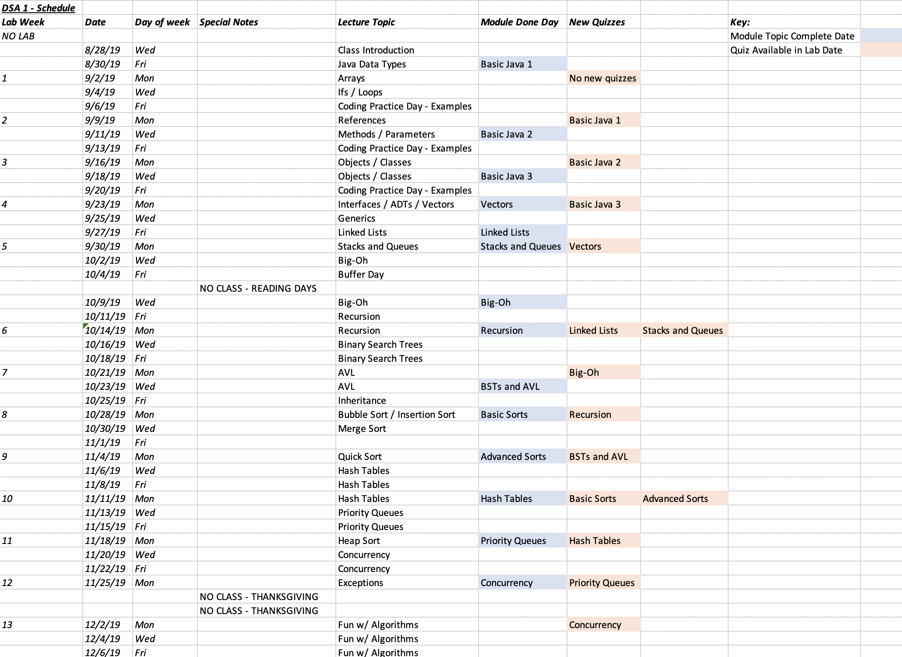

CS2501 - Course Schedule
===============================

[Main Logistics Page](index.html) ([md](index.md))

The table below (sorry for using an image here) describes the schedule for the course. The lecture schedule is shown as well as the day on which a module is expected to be fully covered (blue boxes). In addition, the first lab in which a quiz is available is shown (pink boxes).

{ width=80% }